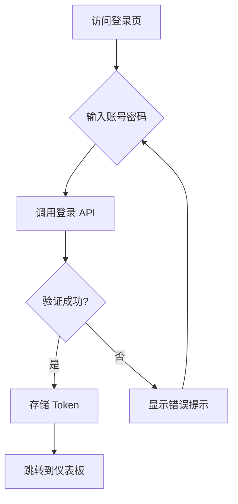
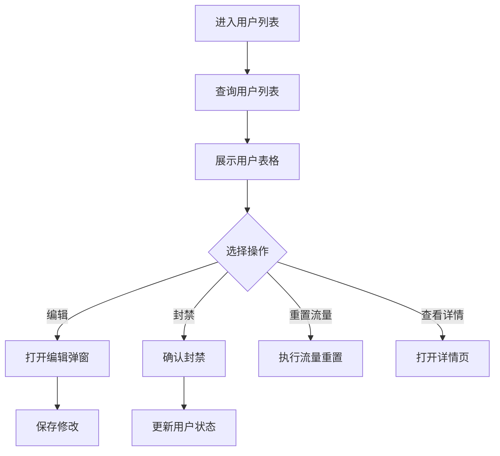
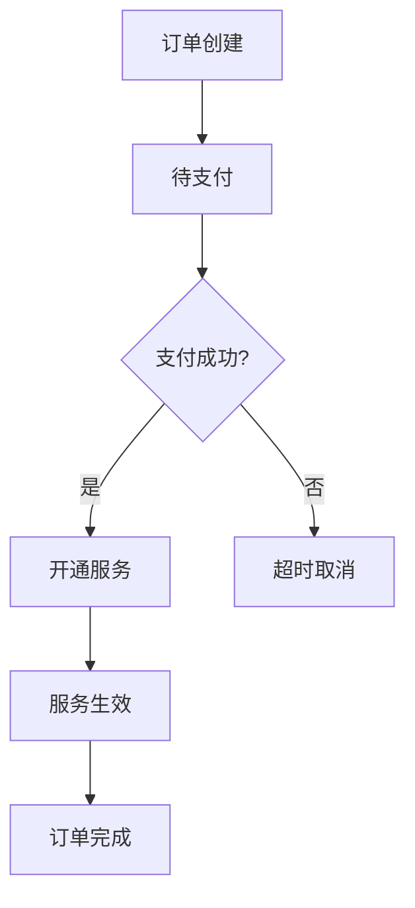

# Xboard 前端重构 - 产品需求文档 (PRD)

## 1. Product Overview

Xboard 是一个代理协议管理面板系统，本次重构目标是将原有的 PHP/Laravel 后端迁移到 Go 语言，同时确保前端实现完全一致的复刻，保持用户体验不变。

- **核心目标**: 实现前后端分离重构，保持 UI/UX 100% 一致
- **目标用户**: 系统管理员、普通用户
- **核心价值**: 高性能、稳定的代理管理平台

## 2. Core Features

### 2.1 User Roles

| Role | Registration Method | Core Permissions |
|------|---------------------|------------------|
| **管理员** | 系统初始化创建 | 完整的系统管理权限 |
| **客服** | 管理员创建 | 工单处理、用户管理 |
| **普通用户** | 邮箱注册/邀请 | 使用代理服务、查看统计 |

### 2.2 Feature Module

**管理后台核心模块:**
1. **登录页面**: 管理员登录认证
2. **仪表板**: 系统概览、统计数据展示
3. **用户管理**: 用户列表、编辑、封禁、流量管理
4. **套餐管理**: 套餐创建、价格配置、流量设置
5. **节点管理**: 节点列表、分组、路由、机器管理
6. **订单管理**: 订单列表、状态管理、退款处理
7. **支付管理**: 支付方式配置、手续费设置
8. **优惠券管理**: 优惠券创建、发放、使用统计
9. **礼品卡管理**: 礼品卡模板、批量生成
10. **工单管理**: 工单列表、回复、状态变更
11. **公告管理**: 公告发布、编辑、展示控制
12. **知识库管理**: 帮助文档管理
13. **统计报表**: 流量统计、订单统计、用户统计
14. **系统配置**: 系统设置、主题配置
15. **插件管理**: 插件安装、启用、配置

### 2.3 Page Details

| Page Name | Module Name | Feature description |
|-----------|-------------|---------------------|
| **登录页** | 登录表单 | 邮箱密码登录、记住我、忘记密码 |
| **仪表板** | 统计卡片 | 用户数、订单数、流量使用、收入统计 |
| **仪表板** | 趋势图表 | 7日趋势、实时数据 |
| **用户管理** | 用户列表 | 分页、搜索、筛选、批量操作 |
| **用户管理** | 用户详情 | 编辑用户信息、重置流量、查看日志 |
| **套餐管理** | 套餐列表 | CRUD 操作、排序、启用/禁用 |
| **套餐管理** | 套餐表单 | 价格配置、流量设置、周期选项 |
| **节点管理** | 节点列表 | 多种协议支持、状态监控 |
| **节点管理** | 分组管理 | 节点分组创建、编辑 |
| **节点管理** | 路由规则 | 路由匹配、动作配置 |
| **订单管理** | 订单列表 | 状态筛选、支付状态、退款操作 |
| **工单管理** | 工单列表 | 优先级、状态、快速回复 |
| **统计报表** | 数据可视化 | 图表展示、数据导出 |
| **系统配置** | 全局设置 | 站点配置、邮件配置、安全设置 |
| **插件管理** | 插件列表 | 安装、启用、配置、更新 |

## 3. Core Process

### 3.1 登录流程

### 3.2 用户管理流程

### 3.3 订单处理流程

## 4. User Interface Design

### 4.1 Design Style

**色彩方案:**
- **主题色**: 绿色系 (`#10b981`) - 主按钮、高亮元素
- **辅助色**: 蓝色系 (`#3b82f6`) - 信息提示、链接
- **警告色**: 橙色 (`#f59e0b`) - 警告提示
- **危险色**: 红色 (`#ef4444`) - 删除、封禁操作
- **背景色**: 深色 (`#0f172a`) - 管理后台主背景
- **卡片色**: 深蓝 (`#1e293b`) - 内容卡片
- **文字色**: 白色/浅灰渐变

**按钮样式:**
- 圆角: `6px`
- 高度: `36px`
- 字体: 14px
- 悬停效果: 轻微放大、阴影加深

**字体:**
- 标题: Inter, 16-24px, 600 weight
- 正文: Inter, 14px, 400 weight
- 小字: Inter, 12px, 400 weight

**布局:**
- 左侧侧边栏 + 右侧内容区
- 卡片式布局
- 响应式设计

### 4.2 Page Design Overview

| Page Name | Module Name | UI Elements |
|-----------|-------------|-------------|
| **登录页** | 登录表单 | 居中布局、卡片式表单、Logo展示、背景渐变 |
| **仪表板** | 统计卡片 | 4个统计卡片、图表区域、快捷操作 |
| **用户管理** | 用户列表 | 表格、搜索框、筛选器、批量操作按钮 |
| **用户管理** | 用户详情 | Tab页、表单、流量图表、操作按钮 |
| **节点管理** | 节点列表 | 表格、协议标识、状态指示灯、操作列 |
| **订单管理** | 订单列表 | 表格、状态标签、金额格式化、操作按钮 |
| **工单管理** | 工单列表 | 优先级标识、状态标签、快速回复按钮 |

### 4.3 Responsiveness

- **桌面端**: 完整功能展示，侧边栏展开
- **平板端**: 侧边栏可折叠，内容自适应
- **移动端**: 侧边栏隐藏，使用菜单按钮切换

### 4.4 交互细节

- **表格操作**: 悬停显示操作按钮
- **表单验证**: 实时验证、错误提示
- **加载状态**: 骨架屏、加载动画
- **消息提示**: Toast 通知、操作反馈
- **模态框**: 确认弹窗、表单弹窗
