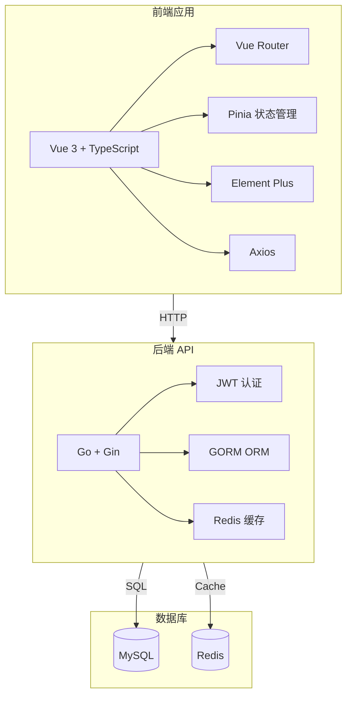
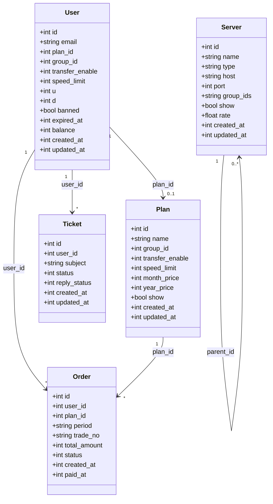

# Xboard 前端重构 - 技术架构文档

## 1. Architecture Design



## 2. Technology Description

| 层级 | 技术 | 版本 | 说明 |
|------|------|------|------|
| **前端框架** | Vue | 3.4+ | 渐进式 JavaScript 框架 |
| **TypeScript** | TypeScript | 5.0+ | 类型安全 |
| **UI 库** | Element Plus | 2.6+ | 企业级组件库 |
| **状态管理** | Pinia | 2.1+ | 轻量级状态管理 |
| **路由** | Vue Router | 4.2+ | Vue 官方路由 |
| **HTTP 客户端** | Axios | 1.6+ | HTTP 请求库 |
| **构建工具** | Vite | 5.0+ | 快速构建工具 |
| **样式** | SCSS | - | CSS 预处理器 |
| **图表** | ECharts | 5.5+ | 数据可视化 |

## 3. Route Definitions

### 3.1 路由结构

```
/                              # 登录页
/admin/                        # 管理后台
├── dashboard                  # 仪表板
├── user                       # 用户管理
│   ├── list                   # 用户列表
│   └── detail/:id             # 用户详情
├── plan                       # 套餐管理
│   ├── list                   # 套餐列表
│   └── edit/:id?              # 套餐编辑
├── server                     # 节点管理
│   ├── manage                 # 节点列表
│   ├── group                  # 分组管理
│   ├── route                  # 路由规则
│   └── machine                # 机器管理
├── order                      # 订单管理
│   ├── list                   # 订单列表
│   └── detail/:id             # 订单详情
├── payment                    # 支付管理
├── coupon                     # 优惠券管理
├── gift-card                  # 礼品卡管理
├── ticket                     # 工单管理
│   ├── list                   # 工单列表
│   └── detail/:id             # 工单详情
├── notice                     # 公告管理
├── knowledge                  # 知识库
├── stats                      # 统计报表
├── config                     # 系统配置
├── mail/template              # 邮件模板
├── plugin                     # 插件管理
└── system                     # 系统状态
```

### 3.2 路由定义表

| Route | Purpose | Component |
|-------|---------|-----------|
| `/` | 登录页面 | `views/auth/Login.vue` |
| `/admin/dashboard` | 仪表板 | `views/dashboard/Index.vue` |
| `/admin/user/list` | 用户列表 | `views/user/List.vue` |
| `/admin/user/detail/:id` | 用户详情 | `views/user/Detail.vue` |
| `/admin/plan/list` | 套餐列表 | `views/plan/List.vue` |
| `/admin/plan/edit/:id?` | 套餐编辑 | `views/plan/Edit.vue` |
| `/admin/server/manage` | 节点管理 | `views/server/Manage.vue` |
| `/admin/server/group` | 分组管理 | `views/server/Group.vue` |
| `/admin/server/route` | 路由规则 | `views/server/Route.vue` |
| `/admin/server/machine` | 机器管理 | `views/server/Machine.vue` |
| `/admin/order/list` | 订单列表 | `views/order/List.vue` |
| `/admin/order/detail/:id` | 订单详情 | `views/order/Detail.vue` |
| `/admin/payment` | 支付管理 | `views/payment/Index.vue` |
| `/admin/coupon` | 优惠券管理 | `views/coupon/Index.vue` |
| `/admin/gift-card` | 礼品卡管理 | `views/giftcard/Index.vue` |
| `/admin/ticket/list` | 工单列表 | `views/ticket/List.vue` |
| `/admin/ticket/detail/:id` | 工单详情 | `views/ticket/Detail.vue` |
| `/admin/notice` | 公告管理 | `views/notice/Index.vue` |
| `/admin/knowledge` | 知识库 | `views/knowledge/Index.vue` |
| `/admin/stats` | 统计报表 | `views/stats/Index.vue` |
| `/admin/config` | 系统配置 | `views/config/Index.vue` |
| `/admin/mail/template` | 邮件模板 | `views/mail/Template.vue` |
| `/admin/plugin` | 插件管理 | `views/plugin/Index.vue` |
| `/admin/system` | 系统状态 | `views/system/Index.vue` |

## 4. API Definitions

### 4.1 认证接口

```typescript
// 登录
POST /api/v2/admin/login
{
  email: string;
  password: string;
  remember?: boolean;
}

// 响应
{
  token: string;
  user: AdminUser;
}

// 获取当前用户
GET /api/v2/admin/user
```

### 4.2 用户管理接口

```typescript
// 用户列表
GET /api/v2/admin/user
{
  page: number;
  page_size: number;
  keyword?: string;
  status?: number;
}

// 用户详情
GET /api/v2/admin/user/:id

// 创建用户
POST /api/v2/admin/user
{
  email: string;
  password: string;
  plan_id?: number;
  group_id?: number;
  transfer_enable?: number;
  ...
}

// 更新用户
PUT /api/v2/admin/user/:id

// 删除用户
DELETE /api/v2/admin/user/:id

// 重置流量
POST /api/v2/admin/user/:id/reset-traffic

// 封禁用户
PUT /api/v2/admin/user/:id/ban
```

### 4.3 套餐管理接口

```typescript
// 套餐列表
GET /api/v2/admin/plan

// 套餐详情
GET /api/v2/admin/plan/:id

// 创建套餐
POST /api/v2/admin/plan
{
  name: string;
  group_id: number;
  transfer_enable: number;
  speed_limit?: number;
  month_price?: number;
  quarter_price?: number;
  year_price?: number;
  ...
}

// 更新套餐
PUT /api/v2/admin/plan/:id

// 删除套餐
DELETE /api/v2/admin/plan/:id
```

### 4.4 通用响应格式

```typescript
interface ApiResponse<T = any> {
  code: number;
  message: string;
  data?: T;
  error?: string;
}

interface PaginationResponse<T = any> {
  data: T[];
  total: number;
  page: number;
  page_size: number;
}
```

## 5. Component Architecture

### 5.1 组件结构

```
src/
├── components/
│   ├── Layout/
│   │   ├── Sidebar.vue       # 侧边栏
│   │   ├── Header.vue        # 顶部导航
│   │   └── MainLayout.vue    # 主布局
│   ├── Common/
│   │   ├── DataTable.vue     # 数据表格
│   │   ├── SearchBar.vue     # 搜索框
│   │   ├── Filter.vue        # 筛选器
│   │   ├── Pagination.vue    # 分页组件
│   │   ├── Dialog.vue        # 弹窗组件
│   │   └── Toast.vue         # 消息提示
│   ├── Form/
│   │   ├── FormInput.vue     # 表单输入框
│   │   ├── FormSelect.vue    # 表单选择器
│   │   ├── FormSwitch.vue    # 表单开关
│   │   └── FormDate.vue      # 日期选择器
│   └── Chart/
│       ├── LineChart.vue     # 折线图
│       ├── BarChart.vue      # 柱状图
│       └── PieChart.vue      # 饼图
├── views/
│   ├── auth/
│   ├── dashboard/
│   ├── user/
│   ├── plan/
│   ├── server/
│   ├── order/
│   ├── payment/
│   ├── coupon/
│   ├── giftcard/
│   ├── ticket/
│   ├── notice/
│   ├── knowledge/
│   ├── stats/
│   ├── config/
│   ├── mail/
│   ├── plugin/
│   └── system/
├── stores/
│   ├── auth.ts               # 认证状态
│   ├── user.ts               # 用户管理状态
│   ├── plan.ts               # 套餐管理状态
│   └── app.ts                # 应用全局状态
├── api/
│   ├── auth.ts               # 认证接口
│   ├── user.ts               # 用户接口
│   ├── plan.ts               # 套餐接口
│   ├── server.ts             # 节点接口
│   ├── order.ts              # 订单接口
│   └── index.ts              # API 配置
├── utils/
│   ├── request.ts            # 请求封装
│   ├── storage.ts            # 本地存储
│   └── format.ts             # 格式化工具
└── types/
    ├── index.ts              # 类型定义
    └── api.ts                # API 类型
```

### 5.2 组件职责

| 组件 | 职责 | 状态管理 |
|------|------|----------|
| **Sidebar** | 侧边导航、菜单展开/折叠 | Pinia (app) |
| **Header** | 顶部导航、用户信息、通知 | Pinia (auth) |
| **DataTable** | 通用数据表格、分页 | 组件内部状态 |
| **SearchBar** | 搜索输入、筛选条件 | 组件内部状态 |
| **Dialog** | 通用弹窗、表单容器 | 组件内部状态 |
| **Toast** | 消息提示、操作反馈 | Pinia (app) |

## 6. Data Model

### 6.1 核心数据模型



### 6.2 TypeScript 类型定义

```typescript
interface User {
  id: number;
  email: string;
  plan_id?: number;
  group_id?: number;
  transfer_enable: number;
  speed_limit?: number;
  u: number;
  d: number;
  banned: boolean;
  expired_at?: number;
  balance: number;
  created_at: number;
  updated_at: number;
}

interface Plan {
  id: number;
  name: string;
  group_id: number;
  transfer_enable: number;
  speed_limit?: number;
  month_price?: number;
  quarter_price?: number;
  year_price?: number;
  show: boolean;
  created_at: number;
  updated_at: number;
}

interface Server {
  id: number;
  name: string;
  type: string;
  host: string;
  port: string;
  group_ids: string;
  show: boolean;
  rate: number;
  created_at: number;
  updated_at: number;
}

interface Order {
  id: number;
  user_id: number;
  plan_id: number;
  period: string;
  trade_no: string;
  total_amount: number;
  status: number;
  created_at: number;
  paid_at?: number;
}

interface Ticket {
  id: number;
  user_id: number;
  subject: string;
  status: number;
  reply_status: number;
  created_at: number;
  updated_at: number;
}
```

## 7. State Management

### 7.1 Pinia Store 结构

```typescript
// stores/auth.ts
interface AuthState {
  token: string | null;
  user: AdminUser | null;
  isLoggedIn: boolean;
}

// stores/app.ts
interface AppState {
  sidebarCollapsed: boolean;
  loading: boolean;
  toast: ToastMessage | null;
}

// stores/user.ts
interface UserState {
  list: User[];
  pagination: Pagination;
  selectedUser: User | null;
}

// stores/plan.ts
interface PlanState {
  list: Plan[];
  selectedPlan: Plan | null;
}
```

## 8. Security

### 8.1 认证机制

- **JWT Token**: 登录后返回 access_token
- **Token 存储**: localStorage + 请求头 Authorization
- **Token 刷新**: 自动检测过期并重新登录
- **权限验证**: 路由守卫检查登录状态

### 8.2 请求安全

- **XSRF 防护**: CSRF token
- **请求签名**: 敏感操作需要签名验证
- **HTTPS**: 强制 HTTPS 连接

## 9. Performance

### 9.1 优化策略

- **懒加载**: 路由组件按需加载
- **缓存策略**: 列表数据缓存、API 请求缓存
- **图片优化**: 使用 WebP 格式、懒加载
- **代码分割**: Vite 代码分割
- **CDN 加速**: 静态资源 CDN 分发

### 9.2 性能指标

| 指标 | 目标 |
|------|------|
| 首屏加载时间 | < 2s |
| API 响应时间 | < 500ms |
| LCP (Largest Contentful Paint) | < 2.5s |
| FID (First Input Delay) | < 100ms |
